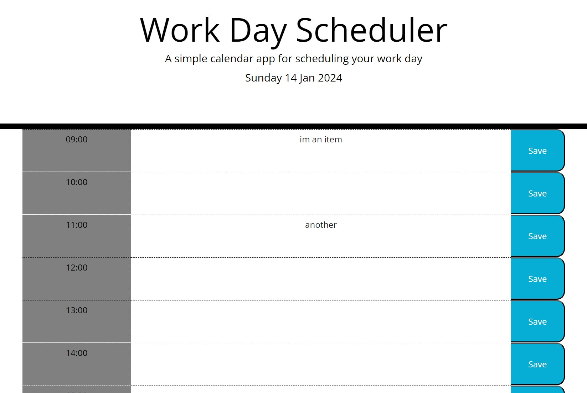

# Work-Day-Scheduler-Kelly-Bearne
A simple calendar application that allows a user to save events for each hour of the day.

## Description

This project fullfils the criteria of building a browser application that allows users to save events for each hour into a Work Day Scheduler app. It features a clean and responsive user interface and utilises HTML, CSS and JavaScript. It also makes use of day.js library.

## Installation

N/A

## Usage

Access the deployed application at the following URL: https://kbearne.github.io/Work-Day-Scheduler-Kelly-Bearne

This application runs in the browser and allows a user to save items in a Work Day Scheduler app. Items which are saved persist when the browser is refreshed (by utilising local storage).

The application displays the current date at the top of the calendar via day.js library. 

It presents timeblocks for standard business hours which are colour coded into past, present and future values (the backgrounds colours are dynamically updated via JavaScript / CSS).

Users can click on a timeblock and enter an event. They can then click on a save button to save the entry (which persists on browser refresh). If a blank value entry is attempted, the user is prompted to enter a value.

## Built with

  

## License

MIT license